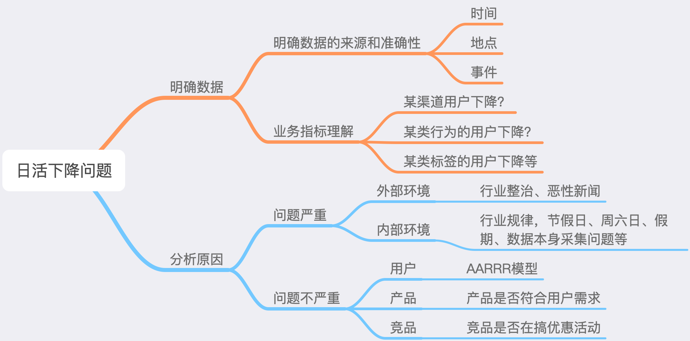
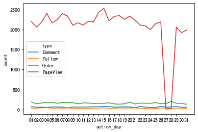
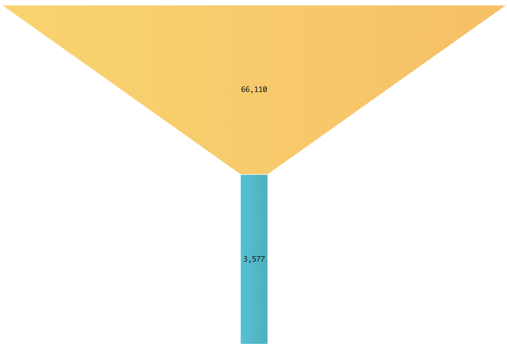

# 一、简介

此数据为某电商平台2018年2月份到2018年4月15号的消费者数据，本文会对电商的用户基础数据、用户行为数据、产品数据、商家数据做一个探索性分析，最后对平台的整体的运营指标数据做一个整体分析

# 二、理解数据

```python
import pandas as pd
import matplotlib.pyplot as plt
import seaborn as sns
import xlwt
%matplotlib inline
```


```python
jd_consumer=pd.read_excel('./京东消费者分析数据.xlsx',sheet_name='JD_Fnl')
```


```python
jd_consumer.head()
```


```python
jd_consumer.info();
```

    <class 'pandas.core.frame.DataFrame'>
    RangeIndex: 183828 entries, 0 to 183827
    Data columns (total 24 columns):
    customer_id               183828 non-null int64
    product_id                183828 non-null int64
    action_time               183828 non-null datetime64[ns]
    action_id                 183828 non-null int64
    type                      183828 non-null object
    age_range                 183745 non-null float64
    gender                    183828 non-null object
    customer_register_date    183828 non-null datetime64[ns]
    customer_level            183828 non-null int64
    city_level                183703 non-null float64
    brand                     183828 non-null object
    shop_id                   183828 non-null int64
    category                  183828 non-null object
    product_market_date       183828 non-null datetime64[ns]
    vender_id                 183828 non-null int64
    fans_number               183828 non-null int64
    vip_number                183828 non-null int64
    shop_register_date        112474 non-null datetime64[ns]
    shop_category             183828 non-null object
    shop_score                183828 non-null float64
    action_hour               183828 non-null object
    action_month              183828 non-null object
    action_day                183828 non-null object
    action_date               183828 non-null object
    dtypes: datetime64[ns](4), float64(3), int64(8), object(9)
    memory usage: 33.7+ MB


```python
jd_consumer['action_date'].describe()
```

该数据包含2018年2月1号到2018年4月15号的数据


    count                  183828
    unique                  75858
    top       2018-02-04 22:53:00
    freq                       15
    first     2018-02-01 00:00:00
    last      2018-04-15 23:59:00
    Name: action_date, dtype: object

为了方便理解数据，方便做数据分析，先给数据做一些分类

| 用户基础数据                                                 | 用户行为数据                                                 | 产品数据                                                     | 商家数据                                                     |
| ------------------------------------------------------------ | ------------------------------------------------------------ | ------------------------------------------------------------ | ------------------------------------------------------------ |
| age_range  年龄分段<br/>gender  性别<br/>customer_registerdate  客户注册日期<br/>customer_level  会员等级<br/>city_level  会员城市等级 | action_date 行为时间<br/>action_id 行为编码<br/>type 行为类别 | product_id 产品编码<br/>brand 产品品牌<br/>product_market_date 产品上市时间<br/>category 产品类别 | shop_id 店铺编码<br/>vender_id 商家编码<br/>fans_number 粉丝数<br/>vip_number 会员数<br/>shop_register_dage开店时间<br/>shop_category 店铺主营<br/>shop_score店铺打分 |


## 三、探索性数据分析

先对用户基础、用户行为数据、产品数据、商家做一个探索性数据分析，便于我们对数据有一个整体的认知，增加对数据的感知度。

### 用户基础数据


```python
#对用户数据去重
jd_consumer_base=jd_consumer[['gender','customer_id','age_range','customer_register_date',
                                       'customer_level','city_level']].drop_duplicates()
```


```python
jd_consumer.rename(columns={'action_date':'action_time'},inplace=True)
```

* 性别、年龄段，会员等级分布


```python
#性别
gender_df=jd_consumer_base.gender.value_counts().reset_index(name='count')
gender_col=gender_df['index']

#年龄段
age_df=jd_consumer_base.age_range.value_counts().reset_index(name='count')
age_col=age_df['index']

#会员等级
customer_level_df=jd_consumer_base.customer_level.value_counts().reset_index(name='count')
customer_level_col=customer_level_df['index']
```


```python
fig,axes=plt.subplots(1,3,figsize=(15,5))
axes[0].pie(gender_df['count'],labels=gender_col,autopct = '%3.1f%%',colors=plt.cm.Dark2.colors)
axes[0].set_title('gender')
axes[1].pie(age_df['count'],labels=age_col,autopct = '%3.1f%%',colors=plt.cm.Dark2.colors)
axes[1].set_title('age_range')
axes[2].pie(customer_level_df['count'],labels=customer_level_col,autopct = '%3.1f%%',colors=plt.cm.Dark2.colors)
axes[2].set_title('customer_level');
```


平台上活跃用户男性占**61%**，女性占**38%**

年龄有6个分段，年龄分段在5和6的占大多数，总共占总体的**76%**

会员等级分为1~7级，7级的人数最多，1、5级也占有较多比重，仅次于7级的人数

* 城市


```python
order=jd_consumer_base['city_level'].value_counts().index
sns.countplot(data=jd_consumer_base,x='city_level',order=order);
```


活跃人数主要集中在4、3、5、1等级的城市

### 商家基础数据


```python
jd_shop=jd_consumer[['shop_id','vender_id','fans_number','vip_number',
                          'shop_register_date','shop_category','shop_score']].drop_duplicates()
#剔除异常值，只保留店铺评分大于0的数据
jd_shop=jd_shop[jd_shop['shop_score']>0]
```

* 前十大主营业务


```python
import squarify 

df = jd_shop.groupby('shop_category').size().reset_index(name='counts').sort_values(by='counts',ascending=False)
labels = df.apply(lambda x: str(x[0]) + "\n (" + str(x[1]) + ")", axis=1)
sizes = df['counts'].values.tolist()
colors = [plt.cm.Spectral(i/float(len(labels))) for i in range(len(labels))]

# Draw Plot
plt.figure(figsize=(10,7), dpi= 80)
squarify.plot(sizes=sizes, label=labels, color=colors, alpha=.8)

# Decorate
plt.title('Treemap of shop_category')
plt.axis('off')
plt.show()
```


店铺主营种类共有9种，其中大多的店都主营食品、家用电器、家私、服饰、美妆


```python
jd_shop['shop_category'].value_counts()
```


    Food                           1106
    Household Eletric Appliance    1015
    Furniture                       898
    Clothes                         767
    Beauty Makeup                   740
    Jewellery Accessories           301
    Mother and Infant               231
    Outdoor Sports                  126
    Electronics                      27
    Name: shop_category, dtype: int64


```python
shop_order=jd_shop.groupby('shop_category')['fans_number'].mean().sort_values().index.tolist()
sns.barplot(x='shop_category',y='fans_number',data=jd_shop,order=shop_order)
plt.xticks(rotation=-80);
```


图中柱状图上的黑条，统计学上叫做置信区间，代表着95%的店铺所对应的粉丝数在黑条的区间范围内。

我们可以发现，主营母婴、家私、家用电子产品、服饰店铺的平均粉丝数都超过了3.5k，其中开母婴店的平均粉丝数最多。买这些东西，或许用户更偏向于自己信赖或者喜欢的店家


```python
jd_shop.groupby('shop_category')['fans_number'].mean().sort_values()
```


    shop_category
    Jewellery Accessories          10198.803987
    Electronics                    13586.703704
    Food                           15579.532550
    Outdoor Sports                 18121.952381
    Beauty Makeup                  26484.836486
    Clothes                        35846.930900
    Household Eletric Appliance    36358.644335
    Furniture                      41710.139198
    Mother and Infant              43201.896104
    Name: fans_number, dtype: float64


### 产品基础数据


```python
jd_product=jd_consumer[jd_consumer['type'].isin(['PageView','Order'])]
jd_product_pv=jd_consumer[jd_consumer['type']=='PageView']
jd_product_order=jd_consumer[jd_consumer['type']=='Order']
```

* 前十大被浏览最多的产品品牌、产品品类以及销量


```python
fig,axes=plt.subplots(1,3,figsize=(15,5))
jd_product_pv['brand'].value_counts()[:10].plot.barh(title='top10 brand of pv',ax=axes[0])
jd_product_pv['category'].value_counts()[:10].plot.barh(ax=axes[1],title='top10 category of pv')
jd_product_order['category'].value_counts()[:10].plot.barh(ax=axes[2],title='top10 category of order')
plt.tight_layout();
```


浏览占比最多的是不知名的品牌，其次是华为与苹果

浏览最多的产品是是手机和外套

被购买最多的是外套和茶，这个季节还是冬季，买外套和茶也合乎常理

### 用户行为数据


```python
#对列重命名
jd_consumer.rename(columns={'action_date':'action_time'},inplace=True)
#提取时间中的小时时段
jd_consumer['action_hour']=jd_consumer['action_time'].apply(lambda x:pd.datetime.strftime(x,'%H'))
jd_consumer_behavior=jd_consumer[['action_hour','customer_id','type']].drop_duplicates()
```


```python
behavior_gb=jd_consumer_behavior.groupby('action_hour').size().reset_index(name='count')
sns.lineplot(x='action_hour',y='count',data=behavior_gb);
```


从下午6点开始，用户使用app的人数逐渐增多，一直到晚上10点达到顶峰。这也符合预期，人们在晚上有较多的空闲时间来支配。

## 2、3月份整体数据对比分析

上面完成对基础数据的了解，现在需要对关键的运营指标做分析了，比如日活、月活，下单转化率等。

这些指标需要对比分析才能知道好坏，此份数据包含了18年2月份到18年4月15号的数据，我只拿出2月份与3月份的数据来做对比分析，看看其中的差异

* 用户月活跃量分析


```python
#对时间数据做一些处理
jd_consumer['action_month']=jd_consumer['action_time'].apply(lambda x:pd.datetime.strftime(x,'%Y-%m'))
jd_consumer['action_day']=jd_consumer['action_time'].apply(lambda x:pd.datetime.strftime(x,'%d'))
jd_consumer['action_date']=jd_consumer['action_time'].apply(lambda x:pd.datetime.strftime(x,'%Y-%m-%d'))
```


```python
#取2、3月份的数据
jd_consumer_2m3m=jd_consumer[jd_consumer['action_month']!='2018-04']
```


```python
month_active=jd_consumer_2m3m[['customer_id','action_month']].drop_duplicates()
month_active['action_month'].value_counts().reset_index(name='count')
```


从整体数据上看2018-3比2018/2的活跃用户环比下降了 **0.6%**，没有太大的波动

* 日活对比分析


```python
day_active=jd_consumer_2m3m[['customer_id','action_day','action_month','type']].drop_duplicates()
jd_consumer_2m=day_active[day_active['action_month']=='2018-02']
jd_consumer_3m=day_active[day_active['action_month']=='2018-03']
jd_consumer_2d=jd_consumer_2m['action_day'].value_counts().reset_index(
    name='count').sort_values(by='index',ascending=True)
jd_consumer_3d=jd_consumer_3m['action_day'].value_counts().reset_index(
    name='count').sort_values(by='index',ascending=True)

fig,ax=plt.subplots(1,1,figsize=(10,5))
sns.lineplot(x='index',y='count',data=jd_consumer_2d)
sns.lineplot(x='index',y='count',data=jd_consumer_3d)
sns.countplot(data=day_active[day_active['type']=='Order'],x='action_day',hue='action_month');
#ax.legend(labels=['2018-02','2018-03']);
```


上面的折线图是2、3月份的日活趋势对比图，下面的直方图表示2、3月份的日销量对比图，

2月份，活跃人数从6号开始一直下滑，直到除夕之夜之后有所反弹，回升至22号，趋于平稳，上下微幅波动。
结合直方图，可以看到2月份1号到7号是一个购物的小高峰期，也就是春节前10天左右，符合节假日前的消费行为情况，
可以推断销量的下降是受春节假期的影响。用户会提前抢购年货，避免节日快递高峰期等。

3月份，27号的日活出现断崖式下跌，直接影响了28号的日活，但奇怪的是27、28号的销量却没有出现太大的波动，和往日差不多。
对于这个奇怪的现象我们需要进一步的探索

* 18年3月份，27号日活骤降的原因分析

关于日活下降的原因，可以从这几个步骤去寻找缘由




```python
#用户的那些应为是下降的
type_3m=jd_consumer_3m.groupby(['action_day','type']).size().reset_index(name='count')
sns.lineplot(x='action_day',y='count',hue='type',data=a);
```




可以看出，除了用户的页面浏览人数骤降外，其它的行为是正常的，
大致可以判断，那天应该是这部分的数据采集除了问题，导致数据没有完全统计到，
当然这也需要跟数据采集的同事去确认才能100%确定。

* 下单转化率分析

这类转化率的问题，常用的到模型AARRR漏斗分析模型。由于数据中的用户行为类别不是很多，我就职选取了浏览到下单这两个数据做转化率分析

​                                                                                               2018年2月份浏览-下单转化量



​                                                                                             2018年3月份浏览-下单转化量


2月份的下单转化率为5.4%，3月份的下单的转化率为7.6%，3月份的下单的转化率比2月份提升了2%，是一个很大的提升。

虽然转化率有所提升，但原始数据缺少了购买金额，无法分析客单价，销售额等数据，所以也就无法判断销售情况


```python
jd_consumer_order=jd_consumer_2m3m[jd_consumer_2m3m['type']=='Order']
#jd_consumer_order_2m=jd_consumer_order[jd_consumer_order['action_month']=='2018-02']
#order_2m=jd_consumer_order_2m['category'].value_counts().reset_index(name='2018-02')[:20]
jd_consumer_order_3m=jd_consumer_order[jd_consumer_order['action_month']=='2018-03']
order_3m=jd_consumer_order_3m['category'].value_counts().reset_index(name='2018-03')

fig,axes = plt.subplots(1,1,figsize=(20,7))
sns.countplot(data=jd_consumer_order,x='category',hue='action_month',order=order_3m['index'])
plt.xticks(rotation=-80);
```


图中可看出，2月份，除了外套、手机、牛仔裤、记事本的销量比3月份的多，其余的物品则是3月份的销量都高于2月份。
虽然3月份很多物品的销量都要高于2月份，但也不能肯定3月份的销售额就比2月份好，
如果外套、手机、牛仔裤的客单价很高的话，就能抬高2月份整体的销售额。

# 总结

通过探索数据分析，可以深入的感知用户基础数据、用户行为数据、产品数据、商家数据，这对后面的对比分析起到了一个非常大的帮助作用。
从这两个月的数据对比来看，运营的情况整体是朝着一个良性的方向缓缓发展的。

这样的分析只是在业务上做了一个解释，或者只是解释了一个已经发生的事情为什么会这样，但这样还远远不够，怎么样通过分析数据，然后反馈到业务去实现业务的增长呢？这是一个需要去考虑的核心问题。
